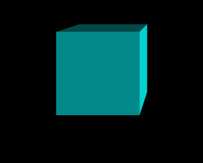

## **브라우저 창 사이즈 변경에 대응**

    function 함수이름() {
        // 카메라 조정
        camera.aspect = window.innerWidth / window.innerHeight;
        camera.updateProjectionMatrix(); // 변화를 업데이트 시켜줌
        renderer.setSize(window.innerWidth, window.innerHeight); // 업데이트시킨것을 렌더러로 다시 그려줌
        renderer.render(scene, camera); // 화면에 렌더링
    }
    window.addEventListener('resize', '함수이름')

뷰포트에서 표현하는 사이즈와 실제 물리적인 픽셀개수가 다름 
고해상도 처리를 하기 위해서는 크기를 더 크게 만든 후 줄여서 사용해야함 
window.devicePixelRatio 해당 기기의 픽셀비율. 밀도를 나타내는 값 
Three.js에서 setPixelRatio를 사용하여 고해상도로 표현해줄수 있음

    renderer.setPixelRatio(window.devicePixelRatio > 1 ? 2 : 1);

## **배경, 투명도**

renderer에 배경색, 투명도 적용

    renderer.setClearColor('#00ff00'); // canvas의 배경색
    renderer.setClearAlpha(0.5); // canvas의 투명도

scene에 배경색 직접 적용

    scene.background = new THREE.Color('blue'); // scene에 직접 선언한것은 렌더러보다 위에 있다고 보면됨

## **Light(조명)**

빛의 위치를 지정하여 아래의 이미지처럼 보여지게끔 처리가 가능함 
MeshBasicMaterial은 빛이 있던 없던 상관없는 재질이라 차이가 없음 
MeshStandardMaterial로 테스트를 하면 아래의 이미치 처럼 보여짐

    const light = new THREE.DirectionalLight(0xffffff, 1); // 빛의 색, 밝기 설정
    light.position.x = 3; // 빛의 위치 설정
    light.position.z = 2; // 빛의 위치 설정
    scene.add(light); // scene에 추가하기

## **애니메이션의 기본, 성능**

[https://developer.mozilla.org/ko/docs/Web/API/Window/requestAnimationFrame](https://developer.mozilla.org/ko/docs/Web/API/Window/requestAnimationFrame) 
setInterval은 성능이슈와 자잘자잘한 문제들 때문에 사용하지 않음 
함수를 하나 만들고 그 안에 애니메이션 관련 값을 집어넣음 
THREE.MathUtils.degToRad(1); // 라디안값을 우리가 아는 각도로 바꿈. 1은 1도 
requestAnimationFrame() 써도 되고, setAnimationLoop() 를 써도 상관 없음 
단, AR, VR화면을 만들땐 무조건 setAnimationLoop() 를 사용해야함 
성능이 좋은기기든 안좋은 기기든 동일한 속도로 애니메이션이 동작하도록

getElapsedTime값을 이용하는 방법

    const clock = new THREE.Clock();

    function draw() {
        const time = clock.getElapsedTime();

        mesh.rotation.y = time;

        renderer.render(scene, camera);
        renderer.setAnimationLoop(draw);
    }
    draw();

delta값을 이용하는 방법

    const clock = new THREE.Clock();

    function draw() {
        const delta = clock.getDelta();

        mesh.rotation.y += delta;

        renderer.render(scene, camera);
        renderer.setAnimationLoop(draw);
    }
    draw();

javaScript 내장함수 Date.now() 를 사용하는 방법

    let oldTime = Date.now();

    function draw() {
        const newTime = Date.now();
        const deltaTime = newTime - oldTime;
        oldTime = newTime;

        mesh.rotation.y += deltaTime * 0.001; // deltaTime값이 크기때문에 작은값을 곱해서 작게만들어 줌
        
        renderer.render(scene, camera);
        renderer.setAnimationLoop(draw);
    }
    draw();

## **Fog 안개**

background와 안개색을 같에한다면 멀어질수록 안개때문에 안보이는 느낌을 줄 수 있음

    scene.fog = new THREE.Fog('black', 3, 7); // Fog('색상', near, far)

## **mesh 배열**

    const meshes = [];
    let mesh;
    for (let i = 0; i < 30; i++) {
        mesh = new THREE.Mesh(geometry, material);
        mesh.position.x = Math.random() * 20 - 10;  // 생성한 mesh의 position을 랜덤으로 배치
        mesh.position.y = Math.random() * 10 - 5;   // 생성한 mesh의 position을 랜덤으로 배치
        mesh.position.z = Math.random() * 3 - 1.5;  // 생성한 mesh의 position을 랜덤으로 배치
        scene.add(mesh);
        meshes.push(mesh);
    }

    function draw() {
        // meshes가 배열이니 forEach로
        meshes.forEach(item => {
            item.rotation.x += deltaTime * 0.001;
            item.rotation.y += deltaTime * 0.001;
        });
    }

## **외부 라이브러리 사용**

애니메이션만 전문적으로 하는 외부 라이브러리 
직접 동작자체를 구현하지 않아도 되기 때문에 생산성, 퀄리티가 올라감 
원하는 움직임이 없다면 직접 구현해야하지만, 그게 아닐경우 라이브러리를 사용하는것도 좋다

    npm i gsap

gsap사용

    import gsap from 'gsap';

    gsap.to( // 대충 이런식으로 사용하여 mesh에 애니메이션을 줘보자
        mesh.position,
        {
            duration: 1,
            y:2,
            z:3
        }
    );
